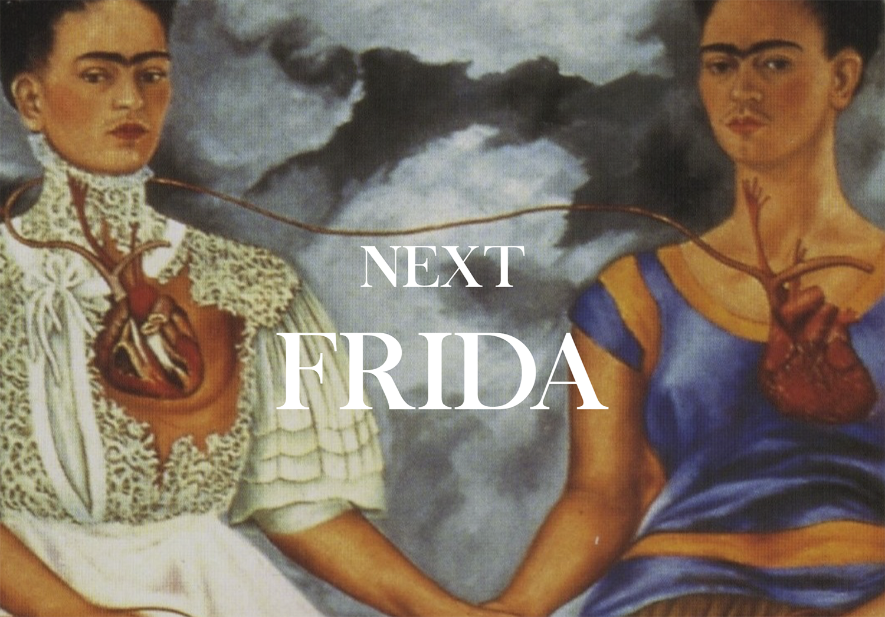
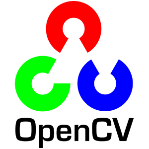
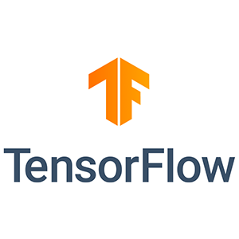
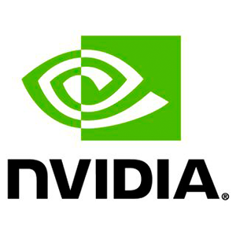
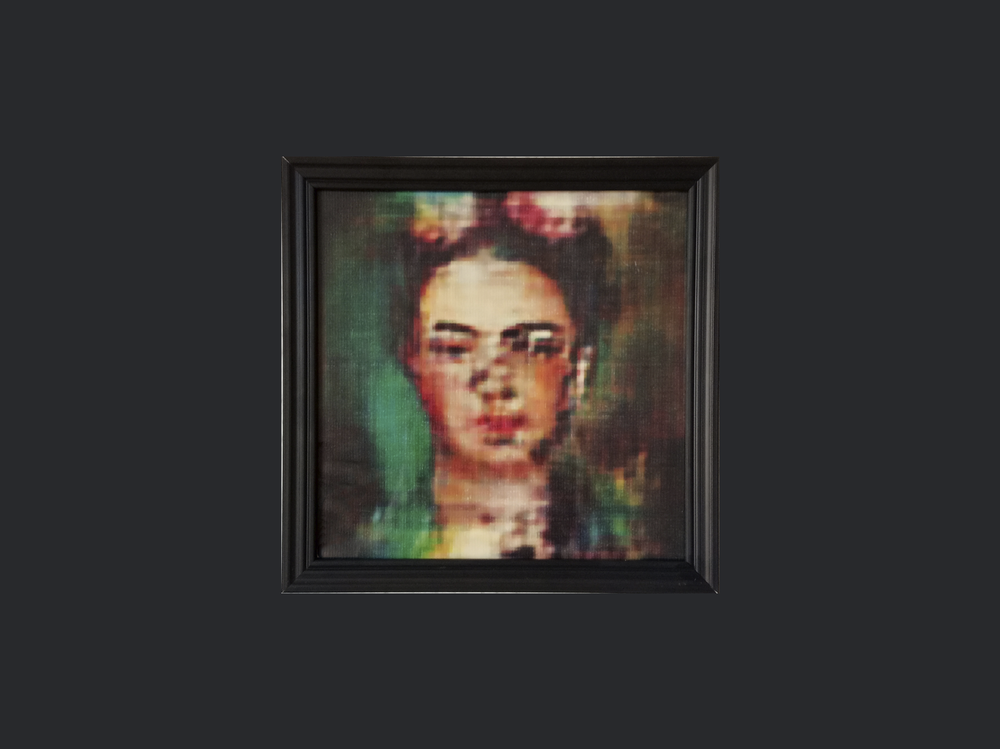

# Next Frida
El objetivo del proyecto **Next Frida** era ver la capacidad que tiene una red neuronal de crear una obra de arte nueva en funciona de otras de otras ofras de la artista Frida Kahlo. Pero porque coger solo la obra de frida cuando podemos tomar toda la creada a partir de ella como símbolo e intentar visualizar que se pintaría hoy en dia. 

**¿Cómo hemos llegado al resultado?** 
La idea era coger todas las pinturas y tratarlo como un sistema único. lo  bueno de tratarlo así es que puede ser analizado. Tras ser analizado encontramos que mas del 57% de las obras eran retratos cercanos, principalmente de mujer, casi siempre mirando al frente. Lo siguiente era centrarse en los detalles había que ser consistente con lo que hubiese dentro de cada cuadro. analizamos todas las obras y nos quedamos con aquellas que cumplieran los parametros de un buen retrato.  Una vez teniamos un volumen aceptable de retratos empleamos redes nueronales generativas adversarias que contiene dos piezas clave: un generador que "que pinta" y aprende de las obras que va visualizando de Frida y discriminador que analiza la obra para detectar una falsificación.
___

**La finalidad** 
Con las GANs (Generative adversarial networks) se ha conseguido generar números a parter de imagenes e incluso caras de personas que realemtne no existe. La finalidad era experimentar con obras de arte pero relamente tiene muchisimas aplicaciones.

**Recursos empleados:** 
___

Recursos   | Descripción | Logo 
---------- | ----------- | ----
OpenCV     |  Librería con multiples algoritmos. Empleada para la detección facial y de ojos asi como para todo el procesamiento de las imágenes.| 
Tensorflow | Librería de machine learning empleada en este caso para para la creación de las redes neurales que he usado | 
Keras      | Framework que se monta sobre Tensorflow y que facilita su desarrollo       | 
Google Colab | Muy bueno para proptotipar usando notebooks con GPU e incluso TPU | 
AI Platform (GCP) | Plataforma de Google Cloud para generar instancias con notebooks rapidamente | 
GPU        |  He usado una NVIDIA Tesla V100 para poder bajar los tiempos de entrenamiento| 

El **Resultado final:** final es una imagen unica generada a partir de todas las obras que se le pasan a la red neuronal intentando imitar asi el estilo de los cuadros que se le han pasado.
___

